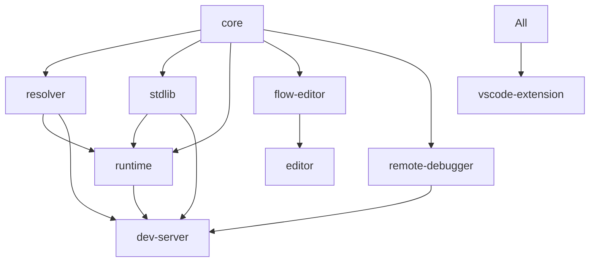

# Flyde Architecture Deep Analysis

## Overview

Flyde is a visual programming language that runs in the IDE and integrates with existing TypeScript code. It's built as a monorepo using pnpm workspaces with the following core packages:

## 1. Package Dependencies and Relationships

### Core Package Structure

```
flyde/ (root)
├── core/           - Core types, execution engine, and flow compilation
├── loader/         - Flow execution runtime (depends on core, stdlib)
├── stdlib/         - Standard library of built-in nodes (depends on core, ui)
├── dev-server/     - Development server for running flows (depends on all above)
├── flow-editor/    - Visual flow editor UI (depends on core)
├── editor/         - Integrated flow manager (depends on flow-editor)
├── remote-debugger/- Remote debugging capabilities
├── ui/             - Shared UI components
└── vscode-extension/ - VS Code integration (depends on all packages)
```

### Dependency Flow



### Key Dependencies

- **@flyde/core**: Foundation package with no Flyde dependencies, only external libs (rxjs, zod, cuid)
- **@flyde/loader**: Depends on core, stdlib, and remote-debugger
- **@flyde/stdlib**: Depends on core and ui
- **VS Code Extension**: Consumes all packages to provide the IDE integration

## 2. Node Capabilities and Types

### Node Type Hierarchy

```typescript
// Base for all nodes
interface BaseNode {
  id: string;
  displayName?: string;
  description?: string;
  inputs: Record<string, InputPin>;
  outputs: Record<string, OutputPin>;
  completionOutputs?: string[];  // Explicit completion mode
  reactiveInputs?: string[];     // Inputs that trigger re-execution
}

// Visual nodes - created in the editor
interface VisualNode extends BaseNode {
  instances: NodeInstance[];      // Internal node instances
  connections: ConnectionData[];  // Wires between instances
  inputsPosition: OMap<Pos>;     // UI positioning
  outputsPosition: OMap<Pos>;    // UI positioning
}

// Code nodes - implemented in TypeScript
interface CodeNode extends BaseNode {
  run: RunNodeFunction;          // Execution function
  defaultConfig?: any;           // Default configuration
  editorConfig?: EditorConfig;   // Custom editor configuration
  sourceCode?: string;           // Source for editing/forking
  isTrigger?: boolean;           // Trigger node flag
}

// Macro nodes - code nodes with dynamic inputs/outputs
interface MacroNode extends CodeNode {
  mode: "advanced";
  inputs: (config) => Record<string, InputPin>;
  outputs: (config) => Record<string, OutputPin>;
}
```

### Node Capabilities

1. **Input/Output Pins**:
   - Static or dynamic (for macro nodes)
   - Optional/required
   - Default values
   - Queue mode for accumulating values

2. **Execution Models**:
   - **Implicit completion**: Node completes when all non-optional inputs are satisfied
   - **Explicit completion**: Node specifies which outputs trigger completion
   - **Reactive inputs**: Specific inputs can trigger re-execution while running

3. **Node Features**:
   - State management (local and global)
   - Cleanup hooks
   - Error handling
   - Custom UI components for configuration
   - Async/promise support

### Node Creation Examples

```typescript
// Simple code node
export const Add: CodeNode = {
  id: "Add",
  description: "Add two numbers",
  inputs: { n1: {}, n2: {} },
  outputs: { sum: { description: "The sum" } },
  run: (inputs, { sum }) => {
    sum.next(inputs.n1 + inputs.n2);
  },
};

// Async node with explicit completion
export const Delay: CodeNode = {
  id: "Delay",
  inputs: { value: {}, delayMs: { defaultValue: 1000 } },
  outputs: { delayedValue: {} },
  completionOutputs: ["delayedValue"],
  run: async (inputs, outputs) => {
    await new Promise(resolve => setTimeout(resolve, inputs.delayMs));
    outputs.delayedValue.next(inputs.value);
  },
};

// Macro node with dynamic inputs
export const Conditional: CodeNode<ConditionalConfig> = {
  id: "Conditional",
  mode: "advanced",
  defaultConfig: { /* ... */ },
  inputs: (config) => ({
    ...extractInputsFromValue(config.leftOperand, "leftOperand"),
    ...extractInputsFromValue(config.rightOperand, "rightOperand"),
  }),
  outputs: { true: {}, false: {} },
  run: (inputs, outputs, adv) => {
    // Access config via adv.context.config
  },
};
```

## 3. Flow Execution Model

### Execution Pipeline

1. **Flow Loading**:
   ```typescript
   loadFlow(path) -> deserializeFlow -> resolveVisualNode -> execute
   ```

2. **Node Resolution**:
   - Visual nodes are recursively resolved
   - Code nodes are loaded from filesystem
   - Macro nodes are processed to expand dynamic pins
   - Dependencies are resolved via ReferencedNodeFinder

3. **Execution Engine** (`core/src/execute/index.ts`):
   - Uses RxJS Subjects for data flow
   - Maintains execution state per node instance
   - Handles implicit/explicit completion
   - Supports reactive inputs
   - Manages cleanup and error propagation

### Key Execution Concepts

1. **State Management**:
   - Each node instance has its own state namespace
   - Global state shared across all nodes
   - Input state tracks received values

2. **Data Flow**:
   - Connections define data paths between nodes
   - Values flow through RxJS Subjects
   - Queue mode accumulates values

3. **Completion Modes**:
   - **Implicit**: Completes when all required inputs received
   - **Explicit**: Completes when specified outputs emit

4. **Debugging Integration**:
   - Debugger events emitted during execution
   - Remote debugger support for VS Code integration

## 4. Integration Points

### TypeScript Integration

1. **Importing Flows**:
   ```typescript
   import { loadFlow } from "@flyde/loader";
   
   const execute = loadFlow<{name: string}>("./MyFlow.flyde");
   const { greeting } = await execute({ name: "World" }).result;
   ```

2. **Creating Custom Nodes**:
   - Export CodeNode from `.flyde.ts` files
   - Nodes automatically discovered by resolver
   - Can import and use any npm packages

3. **Flow Files** (`.flyde`):
   - YAML format with JSON schema validation
   - Contains node definition and connections
   - Can reference external nodes or define inline

### VS Code Extension Integration

1. **Editor Provider**:
   - Custom editor for `.flyde` files
   - Webview-based visual editor
   - Bidirectional communication via messages

2. **Development Server**:
   - Runs flows in child processes
   - Provides node discovery
   - Handles file watching
   - AI node generation support

3. **Debugging**:
   - Remote debugger for execution visualization
   - Real-time data flow inspection
   - Breakpoint support

### API Surface

1. **Runtime API**:
   ```typescript
   loadFlow(flowOrPath, root?, secrets?) -> LoadedFlowExecuteFn
   loadFlowFromContent(flow, path, debuggerUrl, secrets?) -> LoadedFlowExecuteFn
   ```

2. **Core Exports**:
   - Node types and interfaces
   - Execution functions
   - Helper utilities
   - Macro node utilities

3. **Resolver API**:
   - Flow serialization/deserialization
   - Node resolution
   - Import path resolution

## Key Architectural Insights

1. **Separation of Concerns**:
   - Core defines types and execution
   - Runtime handles flow loading
   - Resolver manages dependencies
   - Editor provides visual interface

2. **Extensibility**:
   - Custom nodes via CodeNode interface
   - Macro nodes for dynamic behavior
   - Custom UI components for node configuration
   - Plugin architecture via node packages

3. **Integration-First Design**:
   - Seamless TypeScript integration
   - File-based node discovery
   - Standard npm package compatibility
   - VS Code as primary interface

4. **Performance Considerations**:
   - Lazy node loading
   - Efficient state management
   - Child process isolation for execution
   - Incremental compilation support