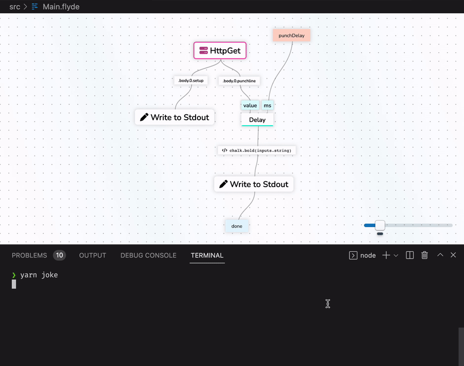

# Flyde Example Project - Dad Jokes in your CLI

CLI tool that tells dad jokes, with a slight delay between the joke's setup and punch-line.
Built using:

- _Flyde_ ✨
- [DadJokes.io](https://dadjokes.io/) for the jokes
- [Meow](https://github.com/sindresorhus/meow) for parsing cli flags
- Typescript

`yarn joke --delay=300

## Running it

1. `yarn`
2. `yarn joke`

## Prerequisites

1. [VS Code](https://code.visualstudio.com/)
2. [Flyde VS Code Extension](https://marketplace.visualstudio.com/items?itemName=flyde.flyde-vscode)
3. Yarn

---

Looking to learn more about Flyde? Visit the official website at https://www.flyde.dev
