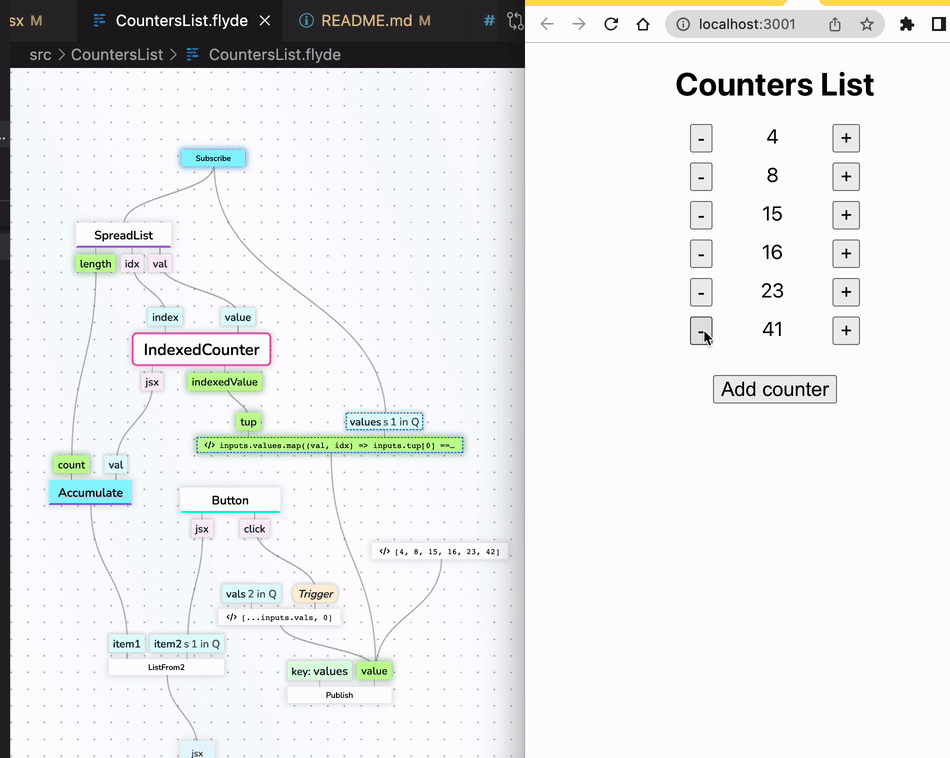

# React Counters List - Flyde Example

An app that manages a list of counters. The main component is build using Flyde and integrates with an existing React code-base.

This example shows how Flyde can be used to build functional-reactive interfaces. It's far from intuitive right now, and suffers from sub-par performance. But hey, it works!

## Where's the state?

- The model of the app is an array of values.
- At first, the default value (`[4, 8, 15, 16, 23, 42]`) is published.
- The subscribe part will emit it and trigger the rendering of the components
- each time a button is pressed, a new value is published, causing everything to rerender again with the right state, which is stored in the part's pins.

---

Looking to learn more about Flyde? Visit the official website at https://www.flyde.dev
