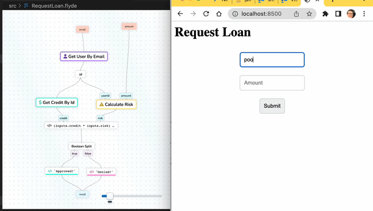

# Request Loan Web App - Flyde Example

A very simplistic "request loan" app that showcases how Flyde can be used to orchestrate high-level services together. Inspiration: the example from [this great blog post](https://www.confluent.io/blog/every-company-is-becoming-software/) by [Confluent](https://www.confluent.io/)

---

Looking to learn more about Flyde? Visit the official website at https://www.flyde.dev
