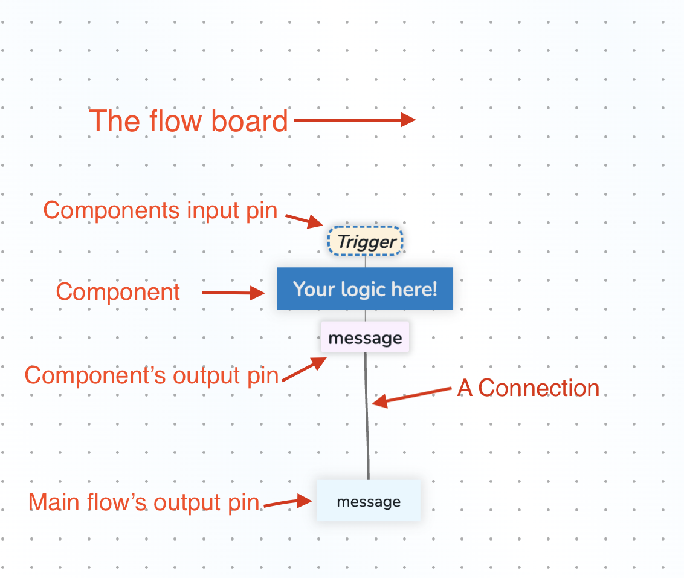

# Hello World with Flyde

This tutorial will guide you step-by-step into creating an "Hello world" program using Flyde. For simplicity, we will use vanilla JS. For TS support check any of the official examples.

This is how the end result should look like:

Resulting code can be in the [examples folder](https://github.com/flydelabs/flyde/tree/main/examples/hello-flyde).

## What you'll need

- [Node.js](https://nodejs.org/en/download/) (LTS version recommended)
- [VS Code](https://code.visualstudio.com/)
- [Flyde for VSCode](https://marketplace.visualstudio.com/items?itemName=flyde.flyde-vscode)

## Step 1: Create a new project

1. Navigate to projects favorite folder
1. `mkdir hello-flyde && cd hello-flyde` - create a new folder to host our future project
1. `npm init --yes` - initializes an empty npm project
1. `npm install @flyde/runtime` - install the runtime package that is responsible for loading and running Flyde flows
1. `code .` to open the project's folder using VSCode. If it's not working, check out [this article](https://code.visualstudio.com/docs/editor/command-line#_code-is-not-recognized-as-an-internal-or-external-command) or just open the folder you've created using VSCode

## Step 2: Code-based sanity checkpoint

To ensure everything is installed properly, paste the following into a new file named `index.js`:

```
const {loadFlow} = require('@flyde/runtime');

console.log('Hello, world!');
```

Then run `node index.js` in the terminal and make sure you're seeing the "Hello, world!" message.

### Step 3: Creating a visual Flyde flow

Now we're getting to the real deal, creating a visual flow! We're going to create a new visual flow that will be saved into a `.flyde` file in your working folder.

1. Right click on the VSCode's sidebar -> "Flyde: New Visual Flow"
2. Name your flow "HelloFlyde" -> accept the file name "HelloFlyde.flyde
3. You should now see a Flyde flow editor tab inside your IDE!


### Quick intro the the visual flow, and terminology

Before moving on, here's a quick intro to Flyde's terminology:  
**The flow board** - it's the canvas where visual flows are edited. Components can be added to the board and connected among themselves or to the flow's main input or output pins  
**A component** - they are the equivalent of "functions" or even data in Flyde  
**Input pin** - Each component can have 0 or more custom input pins, and will always have the built in "Trigger" pin. Input pins are like arguments to functions. By default, whenever all arguments are satisfied, the node is triggered. To have more control on when it should trigger, the Trigger input pin can be used as a way to manually invoke the component  
**Output pin** - Each component can have 0 or more custom output pins, and will always have the built in "Error" pin (needs to be explicitly shown via right-clicking a component). Output pins are like return values of functions, but unlike regular functions, a component may have multiple output pins, and each one may trigger more than once  
**A connection** - a connection connects a component's output pin to another's input pin, creating our control flow and logic  
**Main flow input/output pin** - just like each component has it's inputs and outputs, so does the flow itself. Actually, a flow is just like any another component! Main inputs and outputs are the flow's API to the external world, while the components inside are it's implementation detail



## Step 4: Working with the flow editor

Now it's time to do some changes! We're gonna remove the default placeholder content and replace it with an component that emits a string.

1. click on the "Your logic here!" node and press delete to remove it from the board
2. right click the board and select "New value"
3. Type in `"Hello, Flyde!"` (make sure it's surrounded by quotes so it's a valid string) and click the "save" button
4. Now connect the "r" output pin to the "result" flow's output pin by first clicking on the "r" pin and then on the result (or vice-versa)
5. Don't forget to save (using regular VSCode controls)


### Step 5: Running your flow from the code

Now we're going to connect the Flyde flow you just built to the JS code in `index.js`. Using the `loadFlow` function from `@flyde/runtime`, we'll transform our visual flow into a regular function that will trigger it and log the result back to the console.

1. Open `index.js`
2. Paste the following code:

```javascript
const { loadFlow } = require("@flyde/runtime");
const executeFlow = loadFlow("HelloFlyde.flyde");

const { result } = executeFlow(); // executeFlow can also receive inputs, and other advanced configuration, more on that in the next steps
result.then(({ message }) => console.log(message));
```

3. using your terminal (VSCode's embedded one works perfect for this case) run `node index.js`
4. You should see "Hello, Flyde!" in your console!

Did you notice the visual feedback when it ran? Flyde's runtime connects to a socket-based debugger in the IDE to allow new ways of debugging and troubleshooting programs! You can also inspect the inputs and outputs to learn about the data that passed through them.

### Step 6: Passing arguments from code to the flow

Now we're gonna tweak our example to receive input from the JS code, as an example of how flows can not only integrate to the output but also the input.
Also, you'll see how "inline value" components can expose arguments that will turn into visual inputs.

1. Double click the "Hello, Flyde!" component to open up the inline value editor
2. Type in `` `Hello, ${inputs.name}!` ``. Node we're using the backtick to allow for <a href="https://developer.mozilla.org/en-US/docs/Web/JavaScript/Reference/Template_literals">JS template literals</a>.
3. You should now see a new input pin exposed, named "name". Any usage of the special `inputs` object will expose new input pins that serve as arguments to our component. Cool, right?
4. Now right click the board and click on "New input", call it name. This creates a new input for the flow we're editing
5. connect the new input created to the "name" input of the our inline value component
6. In `index.js`, Add your name to the `executeFlow` function as following:

```
executeFlow({name: 'Your awesome name here'})
    .result.then(({message}) => console.log(message))
```

7. In your terminal, run `node index.js` to see the changes live!


**Congratulations! You've just finished the first Flyde tutorial ✨**

Before moving on to the next tutorial, I highly recommend you to try tinkering with this example:

- Add another input to your message
- rename the "message" main output pin to say "greeting"
- add another output and the same value to it
- Mega bonus points: create a second flow and use it in your first one 🤯 adding new nodes is possible by double clicking the board and searching for a flow

---

If you have any feedback or issue please open a [Github issue](https://github.com/flydelabs/flyde/issues/new) or ping us on Discord.
